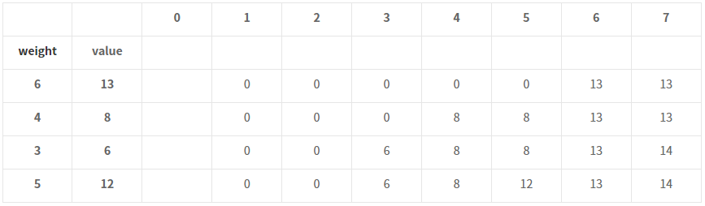

[백준 #12865](https://www.acmicpc.net/problem/12865){: .btn .btn--primary}
Level : 💣💣

---

## ✍Logic
전형적인 '냅색(Knapsack) 알고리즘' 문제.  

간단하게 말하면, 한 도둑이 훔치는 배낭에 담을 수 있는 무게의 최댓값이 정해져 있고, 일정 가치와 무게가 있는 짐들을 배낭에 넣을 때, 가치의 합이 최대가 되도록 짐을 고르는 방법을 찾는 문제이다.  
<br>

### 알고리즘
이 문제는 다음과 같은 알고리즘으로 풀 수 있다. 풀어서 한 번, 식으로 한 번 설명하겠다.  

    1. column축엔 가방 1~K 까지의 무게, row축은 물건 N개 개수 만큼의 배열을 만들어준다.

    2. 행을 차례대로 돌며 다음과 같은 알고리즘을 수행해준다.

        a) 현재 물건 무게가 현재 배낭 무게보다 크다면?  
            이전 행에서 현재 배낭 무게 때의 물건 가치 값을 입력해준다.
        
        b) 현재 물건 무게가 현재 배낭 무게와 같거나 작다면?  
            (1) 현재 물건을 넣고, 남은 무게 만큼의 물건 가치 값을 이전 행에서 가져와 현재 물건 가치와 더해준다.
            (2) 현재 물건을 넣지 않고, 이전 행에서 현재 배낭 무게 때의 물건 가치 값을 가져온다.
            위 두개 값 비교 후 최댓값을 입력해준다.

    3. 이 값은 현재까지의 물건들로 구성할 수 있는 가장 가치 높은 구성이다.

    4. knapsack[N][K]는 곧, 배낭 무게가 K일 때의 최댓값을 가리킨다.  
<br>

### 수식
결국 수식으로 표현하면 다음과 같다.  

knapsack[i][j] = max(현재 물건 가치 + knapsack[이전 물건][현재 가방 무게 - 현재 물건 무게], knapsack[이전 물건][현재 가방 무게])  
```
knapsack[i][j] = max(value + knapsack[i - 1][j - weight], knapsack[i - 1][j])
```  
<br>  

**결국 아래와 같은 테이블이 만들어진다.**  



<br>  

---

## 💻Code

```
if __name__ == '__main__':

    # n: 물품의 수, k: 버티는 최고 무게
    n, k = map(int, input().split())
    item = []

    for _ in range(n):
        weight, value = map(int, input().split())
        item.append([weight, value])

    knapsack = list([0] * (k+1) for _ in range(n+1))            # [1]

    for i in range(1, n+1):
        # now_weight: 현재물건 무게, now_value: 현재물건 가치
        now_weight, now_value = item.pop()

        for j in range(1, k+1):
            if now_weight > j:                                  # [2-a]
                knapsack[i][j] = knapsack[i-1][j]

            else:                                               # [2-b]
                knapsack[i][j] 
                = max(now_value + knapsack[i-1][j-now_weight], knapsack[i-1][j])

    print(knapsack[n][k])                                       # [4]
```
